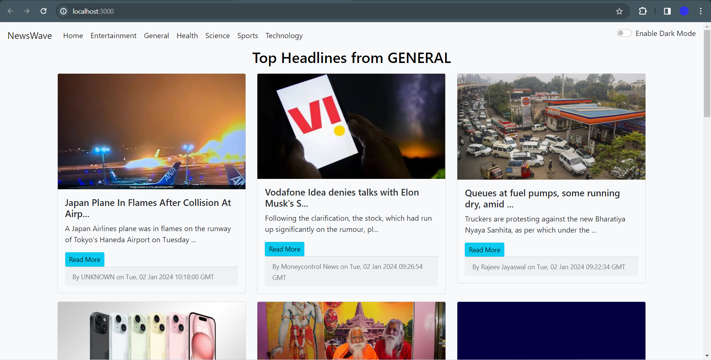
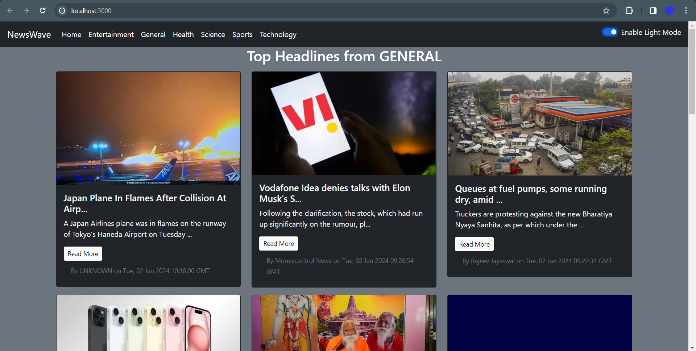
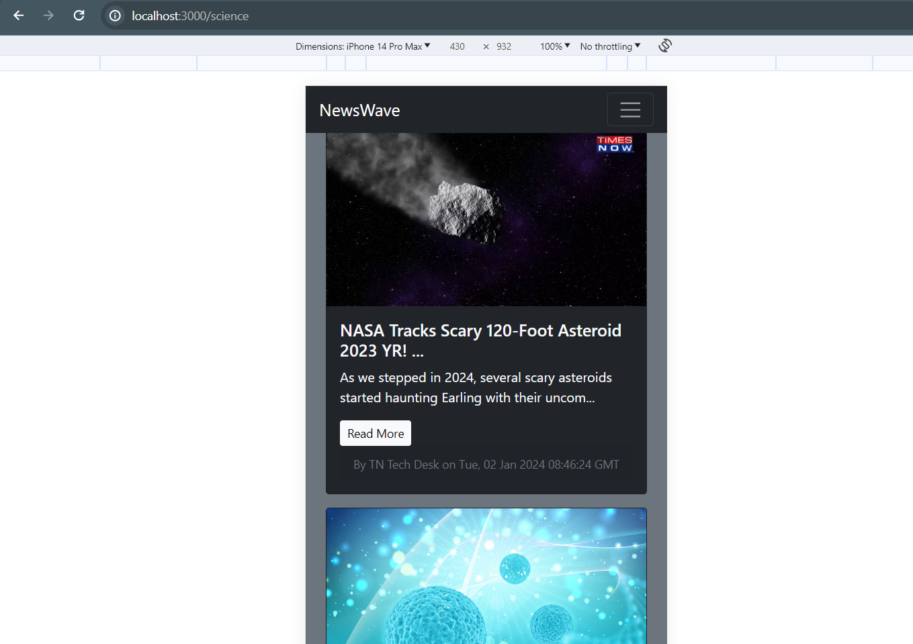

# NewsWave-News App

NewsWave, my latest web project, blends React and NewsAPI for a personalized news experience. Explore diverse categories, enjoy seamless responsiveness, and read comfortably day or night with dark mode. Effortless news browsing is facilitated by infinite scroll. Challenges in integrating these features provided valuable learning experiences, enhancing my skills in state management and asynchronous operations in React. While not for public release, NewsWave reflects my commitment to growth in web development. Feedback is appreciated, and collaboration opportunities are welcome on this dynamic coding journey! 🚀


## Acknowledgements

 - [News API](https://newsapi.org/)


## API Reference

#### Select Country

```http
  GET /api/?country=${country}
```

| Parameter | Type     | Description                |
| :-------- | :------- | :------------------------- |
| `country` | `string` | Your Desired Country |

#### Get item

```http
  GET /api/&category=${category}
```

| Parameter | Type     | Description                       |
| :-------- | :------- | :-------------------------------- |
| category      | `string` | Your Desired Category |


## Features

🌐 Diverse Categories: Explore an extensive array of topics to stay informed and engaged.

💻 Responsive Design: Enjoy a seamless and optimized user experience across different devices.

🎨 Dark Mode: Elevate aesthetics and usability, providing comfortable reading day or night.

♻️ Infinite Scroll: Effortless news exploration with a continuous flow of content.

🔄 React Magic: Immerse yourself in a dynamic and interactive interface crafted with class-based components.

🔗 NewsAPI Integration: Ensure real-time data retrieval, keeping your newsfeed constantly updated.

## Lessons Learned

NewsWave's development presented both challenges and opportunities for growth. Integrating the infinite scroll feature, while enhancing user experience, posed intricacies in managing component states efficiently. Additionally, optimizing NewsAPI integration for seamless data retrieval required a nuanced understanding of asynchronous operations in React.

These challenges fueled my learning journey. I gained insights into efficient state management in class-based components, refined my skills in handling asynchronous operations, and deepened my understanding of dynamic content rendering in React.
## Screenshots




